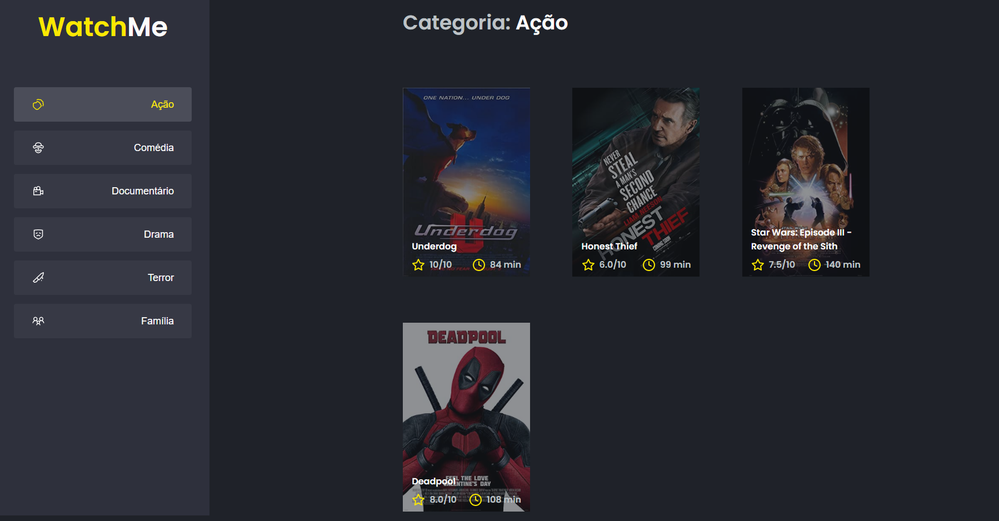
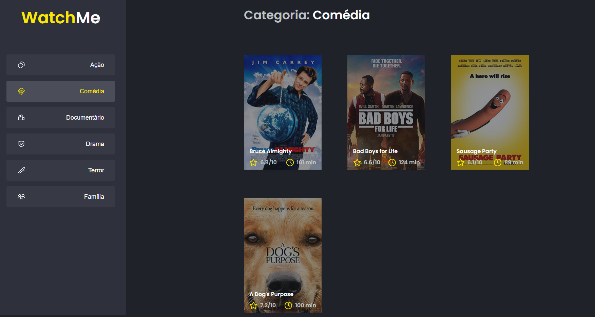

# Desafio 01 - Otimizando a aplicação

<p align="center">


</p>

<br>

## :computer: Sobre o desafio

<hr>

Nesse desafio você deverá performar uma aplicação React utilizando das ferramentas e dicas aprendidas durante o módulo **Performando apps com ReactJS**.

Se você fez o desafio opcional Componentizando a aplicação deve lembrar que se trata de uma aplicação que exibe uma listagem de filmes por categoria com base na categoria selecionada e que esses dados vem de uma API (fake API com JSON Server).

Com essa aplicação componentizada, você deve aplicar os conceitos de performance no React para melhorar esse app.

A seguir veremos com mais detalhes o que e como precisa ser feito 🚀

## Imagens

<div>
   
   <br>
   
</div>

## :rocket: Techs

<ul>
  <li> ReactJS </li>
  <li> TypeScript </li>
  <li> Sass </li>
  <li> React-icons </li>
  <li> Axios </li>
  <li> Json-server </li>
</ul>

## Desenvolvimento

---

### Pré-requisitos

- Instalar [Node.js](https://nodejs.org)

- Instalar [Yarn](https://yarnpkg.com/)

### Clone o repositório

```bash
$ git clone https://github.com/vitorgaletti/ignite-reactjs-otimizando-a-aplicacao.git
```

### Executar Projeto

```bash
# Mudar para directório
$ cd ignite-reactjs-otimizando-a-aplicacao/
```

- Instalar dependências

```bash
$ yarn
```

- Execute

```bash
$ yarn server
```

```bash
$ yarn dev
```

```bash
$ yarn build
```

- Executar scripts

|              Ação              |  Utilização   |
| :----------------------------: | :-----------: |
| Iniciar o servidor json-server | `yarn server` |
|  Iniciar modo desenvolvimento  |  `yarn dev`   |
|     Compilar para produção     | `yarn build`  |

Acesse <http://localhost:8080> para ver o resultado.
